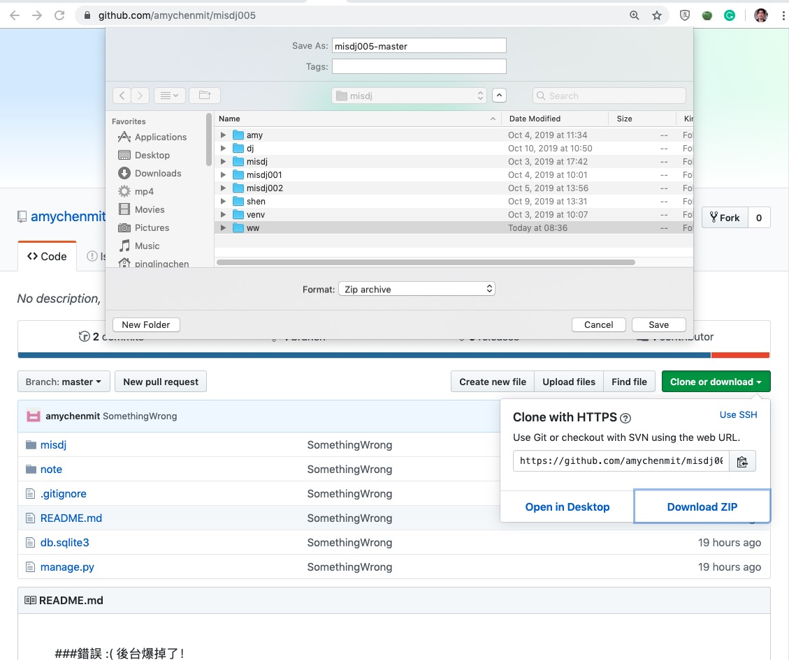
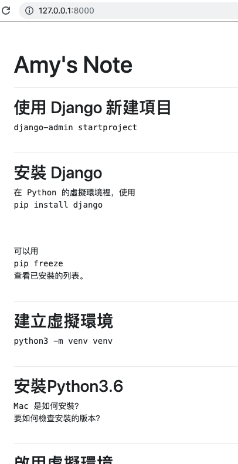

# misdj-2019ww
生成 2019 年的 WW,  work week, list

## 1. 使用 Amy 的 https://github.com/amychenmit/misdj005 為起點



- 先啟動虛擬環境

```
. venv/bin/activate
```


- 下載 Amy 的 misdj005 到你的工作區域
以我的例子，我是放在 /Users/pinglingchen/19/misdj/ww

```
$ pwd
/Users/pinglingchen/19
$ cd misdj
$ ls
2019ww		dj		misdj001	shen		ww
amy		misdj		misdj002	venv
$ . venv/bin/activate
(venv) $ cd ww
(venv) $ ls
misdj005-master.zip
(venv) $ 
```

- unzip

```
(venv) $ unzip misdj005-master.zip 
Archive:  misdj005-master.zip
d22efa61be3c19ff3ff54f50860128dbcf17543b
   creating: misdj005-master/
  inflating: misdj005-master/.gitignore  
  inflating: misdj005-master/README.md  
  inflating: misdj005-master/db.sqlite3  
  inflating: misdj005-master/manage.py  
   creating: misdj005-master/misdj/
 extracting: misdj005-master/misdj/__init__.py  
  inflating: misdj005-master/misdj/settings.py  
  inflating: misdj005-master/misdj/urls.py  
  inflating: misdj005-master/misdj/wsgi.py  
   creating: misdj005-master/note/
 extracting: misdj005-master/note/__init__.py  
  inflating: misdj005-master/note/admin.py  
  inflating: misdj005-master/note/apps.py  
   creating: misdj005-master/note/migrations/
  inflating: misdj005-master/note/migrations/0001_initial.py  
  inflating: misdj005-master/note/migrations/0002_note_detail.py  
  inflating: misdj005-master/note/migrations/0003_note_seq.py  
  inflating: misdj005-master/note/migrations/0004_note002.py  
  inflating: misdj005-master/note/migrations/0005_auto_20191010_1502.py  
 extracting: misdj005-master/note/migrations/__init__.py  
  inflating: misdj005-master/note/models.py  
   creating: misdj005-master/note/templates/
   creating: misdj005-master/note/templates/note/
  inflating: misdj005-master/note/templates/note/base.html  
  inflating: misdj005-master/note/templates/note/index.html  
  inflating: misdj005-master/note/tests.py  
  inflating: misdj005-master/note/urls.py  
  inflating: misdj005-master/note/views.py  
(venv) $ ls -ll
total 48
drwxr-xr-x@ 8 pinglingchen  staff    256 Oct 11 13:58 misdj005-master
-rw-r--r--@ 1 pinglingchen  staff  21294 Oct 12 08:35 misdj005-master.zip
(venv) $ 
```
- 進入目錄, 用 tree 確認一下完整性，運行服務器

```
(venv) $ cd misdj005-master
(venv) $ tree
.
├── README.md
├── db.sqlite3
├── manage.py
├── misdj
│   ├── __init__.py
│   ├── settings.py
│   ├── urls.py
│   └── wsgi.py
└── note
    ├── __init__.py
    ├── admin.py
    ├── apps.py
    ├── migrations
    │   ├── 0001_initial.py
    │   ├── 0002_note_detail.py
    │   ├── 0003_note_seq.py
    │   ├── 0004_note002.py
    │   ├── 0005_auto_20191010_1502.py
    │   └── __init__.py
    ├── models.py
    ├── templates
    │   └── note
    │       ├── base.html
    │       └── index.html
    ├── tests.py
    ├── urls.py
    └── views.py

5 directories, 22 files
(venv) $ ./manage runserver
-bash: ./manage: No such file or directory
(venv) $ ./manage.py runserver
Watching for file changes with StatReloader
Performing system checks...

System check identified no issues (0 silenced).
October 12, 2019 - 00:56:15
Django version 2.2.6, using settings 'misdj.settings'
Starting development server at http://127.0.0.1:8000/
Quit the server with CONTROL-C.
```

- 用流覧器查看主頁，效果如下，這是我們今天的共同起點。


