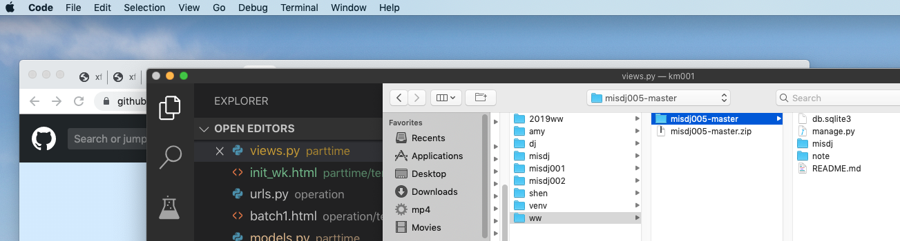
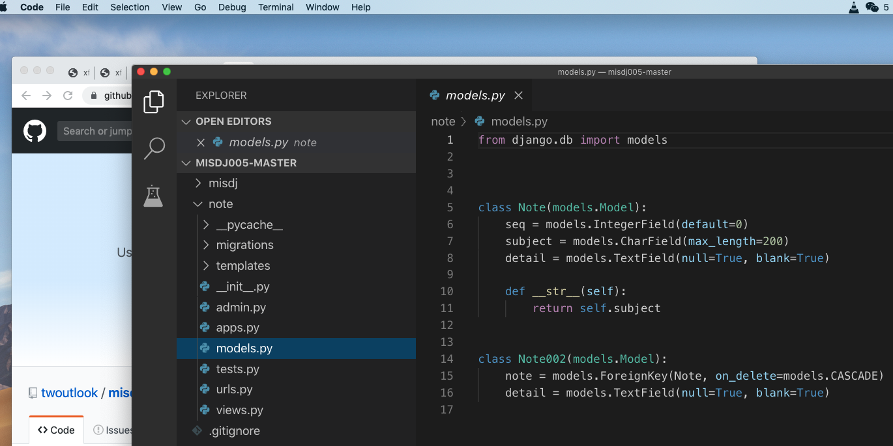
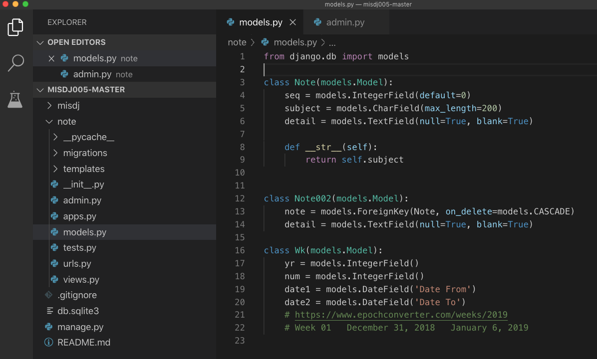
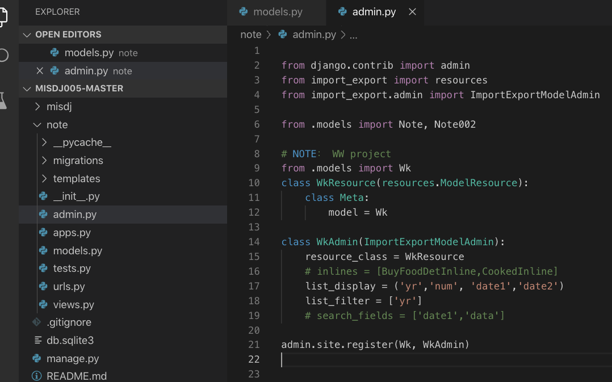
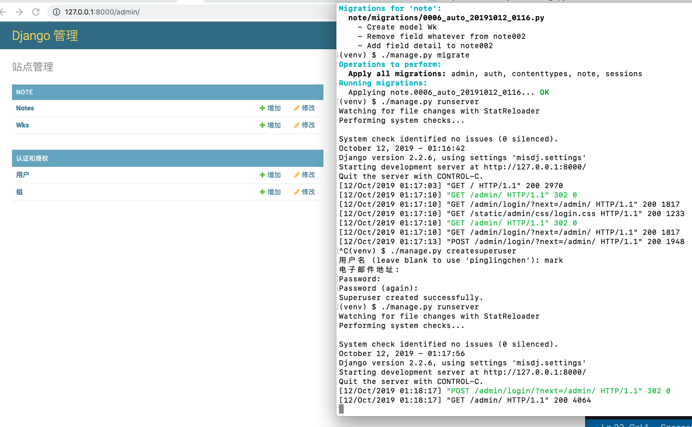
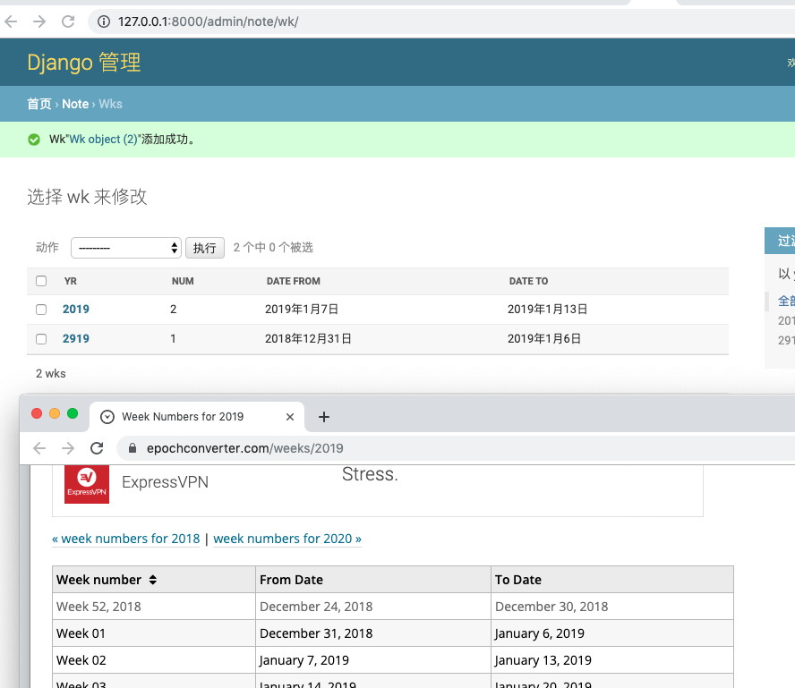

# 開始這項目的編程


## 1. 打開工作項目



## 2. 打開 models 檔案




## 3. 加入以下代碼
```
class Wk(models.Model):
    yr = models.IntegerField()
    num = models.IntegerField()
    date1 = models.DateField('Date From')
    date2 = models.DateField('Date To')
    # https://www.epochconverter.com/weeks/2019
    # Week 01	December 31, 2018	January 6, 2019
```


## 4. 打開 admin 檔案, 加入以下代碼


```
# NOTE： WW project
from .models import Wk
class WkResource(resources.ModelResource):
    class Meta:
        model = Wk

class WkAdmin(ImportExportModelAdmin):
    resource_class = WkResource
    # inlines = [BuyFoodDetInline,CookedInline]
    list_display = ('yr','num', 'date1','date2')
    list_filter = ['yr']
    # search_fields = ['date1','data']
   
admin.site.register(Wk, WkAdmin)

```


## 5. 更新數據庫，自己加個超級用戶，啟動服務器



## 6. 按範例網站手動加上兩筆


