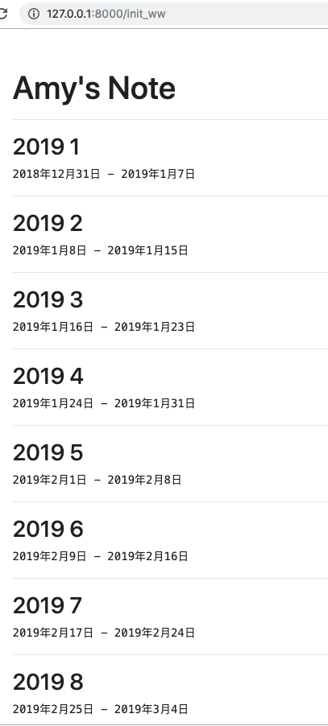
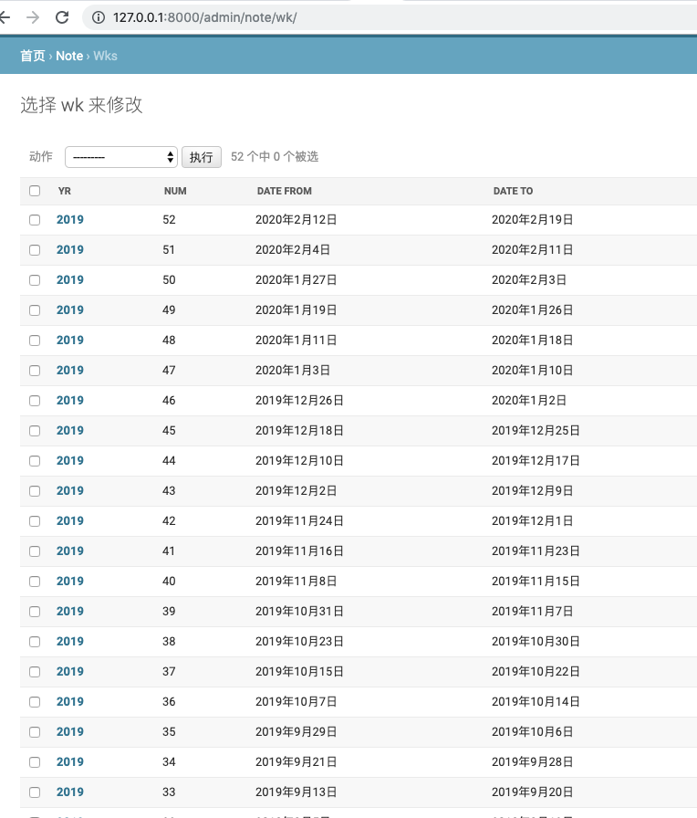
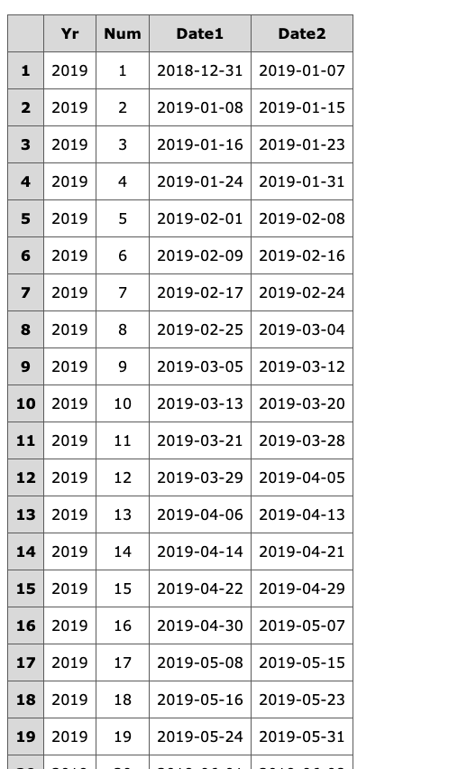

# 用程序生成 52 筆


## 1. views

```
from django.shortcuts import render

from datetime import date, timedelta
from datetime import datetime

from .models import Note
from .models import Wk

def index(request):
    list = Note.objects.all()
    context = {'list': list}
    return render(request, 'note/index.html', context)

def ww(request):
    list = Wk.objects.all()
    context = {'list': list}
    return render(request, 'note/ww.html', context)

def init_ww(request):
    def getList():
        return Wk.objects.order_by('yr','num')
    def getCnt():
        return Wk.objects.count()
        
    # https://docs.djangoproject.com/en/2.2/intro/tutorial02/
    # list = Wk.objects.order_by('yr','num')
    list = getList()
    
    for x in list:
        x.delete()
 
    k1 = getCnt()
    
    d1='2018-12-31'
    date1 = datetime.strptime(d1, "%Y-%m-%d")
    date2 =date1 + timedelta(days=7)
   
    for num in range(1,53):
        # print(num) # to ensure num is 1,2,3 ..., 52
        date2 =date1 + timedelta(days=7)
        
        x =Wk(yr=2019,num=num,date1=date1,date2=date2)
        x.save()
        
        date1 =date2 + timedelta(days=1)
        
    k2 = getCnt()
    
    user = request.user

    key={'k1':k1,'k2':k2}
    list = getList()
    context = {'user': user,'key': key,'list':list }
    return render(request, 'note/ww.html', context)
```

## 2. ww.html
```





<h1><br>Amy's Note</h1>


<hr>
<h3>{{x.yr}} {{x.num}}</h3>
<pre>{{x.date1}} - {{x.date2}} </pre>



```

## 3. urls
```
from django.urls import path
from . import views
app_name = 'note'

urlpatterns = [
    path('ww', views.ww, name='ww'),
    path('init_ww', views.init_ww, name='init_ww'),
    path('', views.index, name='index'),
]
```
## 4. result


## 5. 驗証後台


## 6. 如何做成表格格式，自己努力做，可以上網用各種方法查。注意，在做成TABLE的格式時，不要破壞了原本的列表方式，可以加一個頁面叫 ww2, 用來顯示表格。



## 7. 補充說明。之前 Amy 有去觀察 id, init_ww 基本上做一次就可以了，所以以後要加權限，不給一般用戶操作。如果多次操作，會有什麼要注意的事項?Homework!


